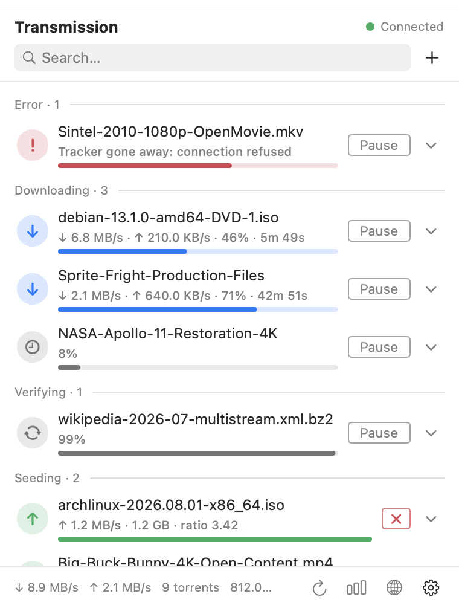
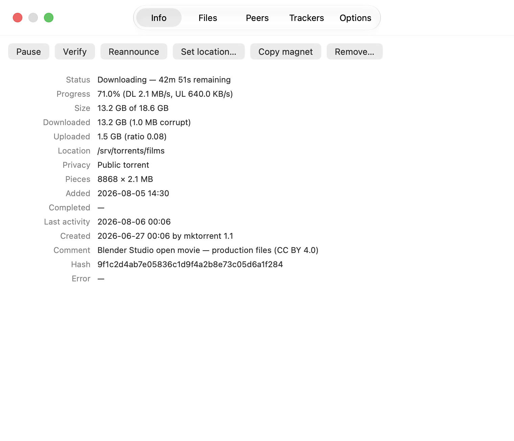
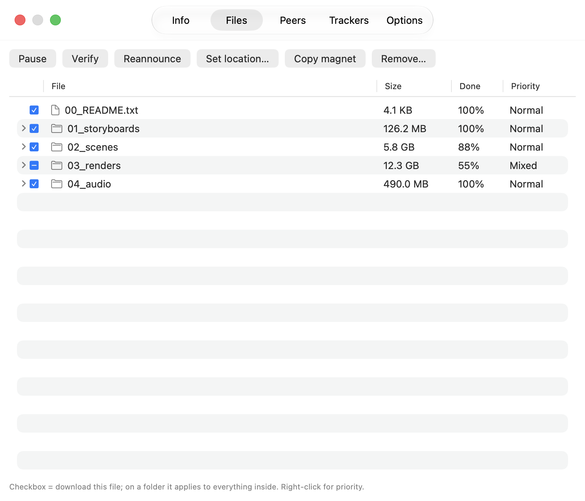
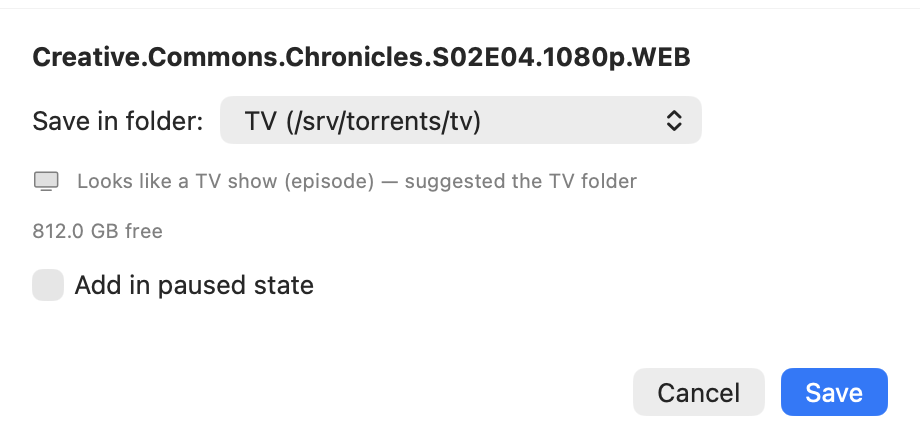
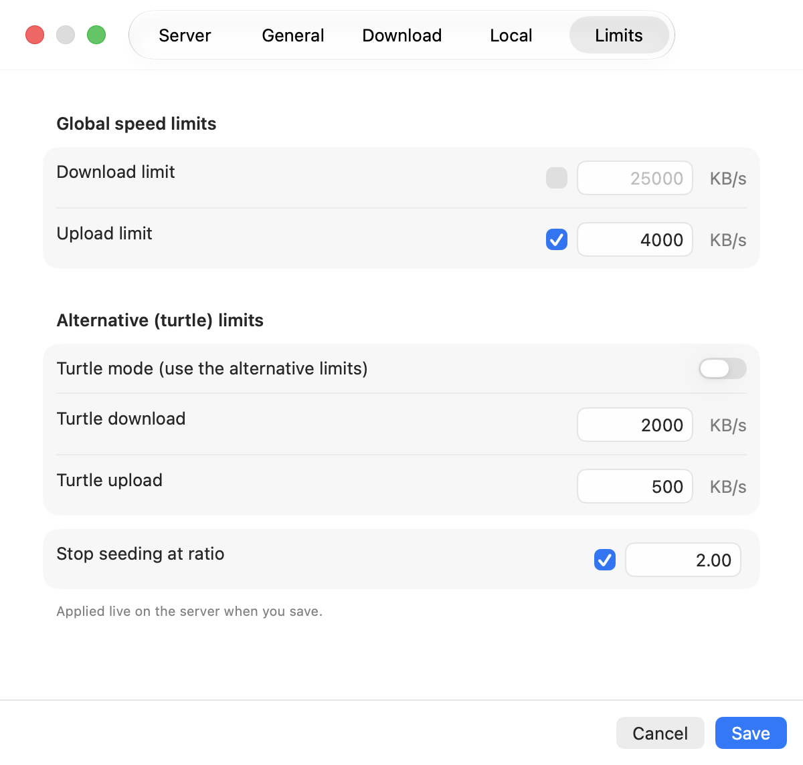
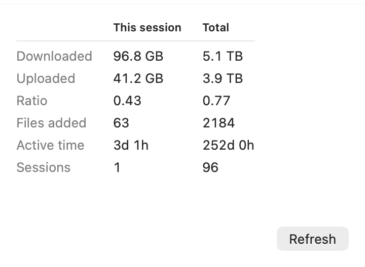
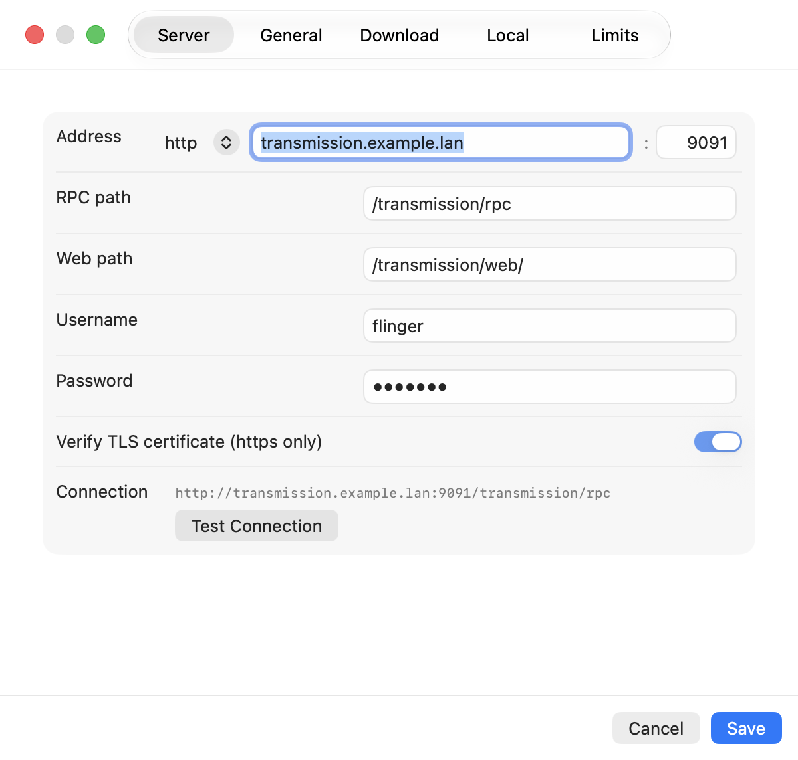

# Torrent Flinger

**Run your remote Transmission server from the menu bar.** Click a magnet link
in any browser and it goes straight to your NAS — no browser extension, no web
UI, no ssh.

Native apps for **macOS** and **Linux**, talking to the same server and sharing
the same config file.

<p align="center">
  
</p>

---

## What it does

### Everything at a glance

Torrents grouped by status — errors first, then downloading, verifying,
seeding, paused, finished — with per-group counts, live speeds, ETA and a
state-coloured progress bar. Search filters as you type. Click a row to expand
it in place; select several with `Shift`/`Ctrl` and act on all of them at once.

<p align="center">
  
</p>

On macOS the current speed sits in the menu bar itself, averaged over a widening
window so it reads as a number rather than a flicker: live for the first 15
seconds, then a 15-second average, then a 30-second one.

### Per-torrent administration

Everything transmission-remote gives you, in a window: sizes, ratio, dates,
hash, piece geometry, peers, trackers, and per-torrent limits.

<p align="center">
  
</p>

**Pick apart a torrent's files.** Transmission hands back a flat list of paths;
this folds them into a directory tree. Folders aggregate size, progress and
priority, and a folder's checkbox applies to everything inside it — so
deselecting a season, or setting a whole directory to low priority, is one
click instead of six hundred. Right-click a torrent and **Torrent files…**
opens straight onto it.

<p align="center">
  
</p>

### Somewhere for links to go



Register as the system's magnet and `.torrent` handler and every link in every
browser lands on your server. The add dialog offers your custom directories by
label, remembers the last one, shows free space for the selected directory, and
**recognises TV episodes** (`S03E05`, `1x02`, air dates, season packs) to
pre-select your TV folder.

Copy a magnet link and open the app: it notices and offers to add it.

<br clear="right">

### Server administration

Global speed limits, turtle mode and its separate limits, and the default seed
ratio — edited live on the server when you save. Plus session statistics,
start/pause all, and a jump to the full web interface.

<p align="center">
  
  
</p>

---

## Quick start

### macOS

Requires macOS 14+ and the Xcode Command Line Tools (`xcode-select --install`).

```bash
git clone https://github.com/python2121/torrent-flinger.git
cd torrent-flinger/macos
./install.sh
```

That builds a release binary, assembles `TorrentFlinger.app`, signs it ad-hoc,
installs it to `/Applications` and launches it. Then:

1. Click the menu-bar magnet → **Options…**
2. Enter your server's address, port and credentials → **Test Connection**
3. Approve the **Local Network** prompt when macOS asks — without it, macOS
   silently blocks connections to a LAN address and the app just says
   "Disconnected"

<p align="center">
  
</p>

The app lives in the menu bar, not the Dock. `install.sh` also registers the
bundle with LaunchServices, so browsers will offer it for magnet links and
Finder will offer it for `.torrent` files. More detail in
[`macos/README.md`](macos/README.md).

### Linux

Flatpak is the deployment target:

```bash
git clone https://github.com/python2121/torrent-flinger.git
cd torrent-flinger
./linux/scripts/build-flatpak.sh          # user-level, no root
flatpak run io.github.python2121.TorrentFlinger
```

The exported `.desktop` registers the magnet and `.torrent` handlers with your
browsers automatically. Sandbox permissions are minimal: network, tray,
notifications. It works on SteamOS's immutable filesystem — if building *inside*
a distrobox fails (nested sandboxing), run the same script on the host.

Or run it from a venv without installing anything system-wide:

```bash
./linux/scripts/setup.sh                  # .venv + PySide6
./linux/bin/torrent-flinger
./linux/scripts/install-linux.sh          # register the link handlers
```

Then: right-click the tray icon → **Options…** → set your server → **Test
Connection**.

The popup is styled after KDE Plasma's own applets and takes all its colours
from the system palette, so Breeze light and dark both look right.

### Using both

The two builds read and write the same `config.json` with the same keys, so a
server you set up on one is a copy-paste away on the other:

| Platform | Path |
|---|---|
| macOS | `~/Library/Application Support/torrent-flinger/config.json` |
| Linux | `~/.config/torrent-flinger/config.json` |

---

## Compatibility

Transmission **3.x and 4.x**, plus the various NAS reimplementations — the
client targets the pre-4.1 RPC protocol and decodes every field leniently,
because servers disagree about which ones they send. HTTP Basic auth and
self-signed certificates (via an opt-out TLS check) are both supported, because
that's what a NAS actually serves.

## Contributing / hacking

The two apps are independent — nothing in `macos/` can break `linux/flinger/` or the
other way round — and both are documented for people arriving cold:

- [`docs/`](docs/) — architecture, the RPC layer and its quirks, config keys,
  a file-by-file catalogue of both builds, and how the tests work
- [`macos/CLAUDE.md`](macos/CLAUDE.md) — the macOS build's commands and the
  gotchas that cost real time
- [`macos/FEATURE_MAP.md`](macos/FEATURE_MAP.md) — every macOS feature and where
  it lives

```bash
cd linux && PYTHONPATH=. .venv/bin/python -m unittest discover tests   # Linux suite
cd macos && ./test.sh                                                  # macOS suite
```

The screenshots above are generated against an invented server
(`--show-window <window> --demo`), never a real one — see
[`docs/macos.md`](docs/macos.md#regenerating-the-screenshots).

## Credits

UI layout and feature set researched from Transmission Remote Plus (the Chrome
extension in `chrome-transmission-remote-plus-master/`, Apache-2.0 — icons
reused from it), Tremotesf, transmission-remote-gtk, transgui, Fragments,
Transmissionic, and Transmission's own Qt and web clients. The popup design
follows KDE's plasma-nm applet and HIG measurements.
